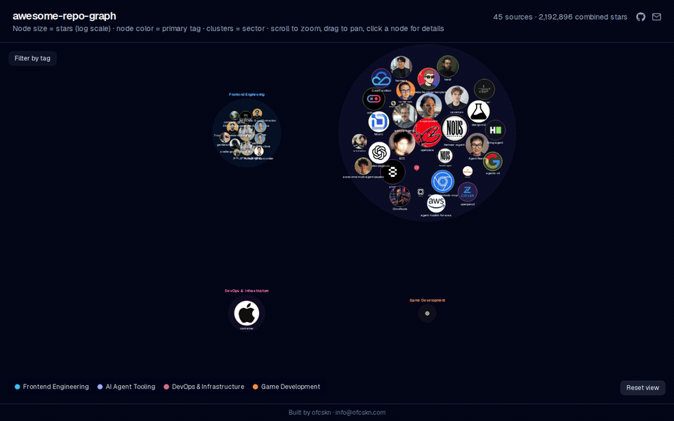

# awesome-repo-graph

  

A curated, structured collection of open-source repositories, grouped by sector and category, cross-linked by shared tags. `sources.json` is the single source of truth; this file and the graph visualization are both generated from it.

**[View the live graph →](https://ofcskn.github.io/awesome-repo-graph/)**



## Contents

- [Live demo](#view-the-live-graph)
- [How this repository works](#how-this-repository-works)
- [Adding a source](#adding-a-source)
- [Contributing securely (approved agents)](#contributing-securely-approved-agents)
- [Graph visualization](#graph-visualization)
- [Demo GIF](#demo-gif)
- [Sectors](#sectors)
- [Catalog](#catalog)
- [License](#license)

## How this repository works

- **`sources.json`** holds every tracked source: URL, provider, taxonomy `path`, tags, license, and GitHub star score.
- **This file (`README.MD`)** is generated from `sources.json` by `scripts/generate-readme.js` — do not edit it directly.
- **`AGENTS.MD`** documents the ruleset for adding sources correctly (dedup, taxonomy, tagging conventions) for both humans and AI agents.
- **`web/`** is a Next.js app that renders the same data as an interactive graph (node size = stars, edges = shared tags, clusters = sector).

## Adding a source

```
node scripts/add-source.js \
  --url "https://github.com/owner/repo" \
  --path "Sector>Category>Subcategory" \
  --tags tag-one,tag-two
```

This automatically rejects duplicates, detects the provider, fetches GitHub stars/license, and regenerates this README. See `AGENTS.MD` for full conventions. Refresh star counts periodically with:

```
node scripts/refresh-scores.js
```

## Contributing securely (approved agents)

Entries only enter `sources.json` through an **approved, verifiable agent**. A pull request that changes `sources.json` or `README.MD` must carry a cryptographic attestation, committed as `agent-attestation.json`, proving the change was produced by an agent listed in `agents/approved-agents.json`. The `approved-agent-gate` CI check re-validates the added entries against the mechanical policy and verifies the attestation's Ed25519 signature and content digests; a raw, hand-edited catalog change fails the check.

Only public keys live in the repository — signing keys are held as CI secrets or on an operator's machine and are never committed. See `docs/agent-gateway.md` for the trust model and how to become an approved agent.

## Graph visualization

The live version is deployed via GitHub Pages: **[https://ofcskn.github.io/awesome-repo-graph/](https://ofcskn.github.io/awesome-repo-graph/)**.

To run it locally instead:

```
cd web && npm install && npm run dev
```

Renders an interactive, GSAP-animated graph of every source at `localhost:3000` — circle size reflects star count, edges connect sources sharing tags.

## Demo GIF

The animated demo above (`assets/demo.gif`) is generated, not hand-made. On every push to `main`, a workflow builds the graph, drives it through a scripted scene (initial render → tag filter → zoom → inspect a node → settle) with a headless browser, and assembles the frames into an optimized looping GIF that is committed back — so the demo always reflects the current site.

To regenerate it locally:

```
cd web && npm ci && npm run build
cd ../tools/demo-capture && npm install && npx playwright install --with-deps chromium
npm run capture:demo
```

`ffmpeg` must be on your `PATH`. The scene and all tunables (frame rate, size, per-beat frame counts) live in `tools/demo-capture/scene.mjs`; see `docs/demo-capture.md` for details.

## Sectors

- **Frontend Engineering** — 12 sources
- **AI Agent Tooling** — 33 sources
- **DevOps & Infrastructure** — 1 source
- **Game Development** — 21 sources
- **Backend Engineering & APIs** — 24 sources
- **Machine Learning & Data Science** — 21 sources
- **Blockchain & Decentralized AI** — 46 sources
- **Developer Productivity & CLI Tools** — 1 source

## Catalog

<details>
<summary><strong>Frontend Engineering</strong> — 12 sources</summary>

### GSAP
#### GSAP Website Examples
- **[award-winning-website](https://github.com/adrianhajdin/award-winning-website)**  
  ★ 1,021 · `gsap` `landing-page`
- **[jsm_gta_vi_landing](https://github.com/adrianhajdin/jsm_gta_vi_landing)**  
  ★ 196 · `gsap` `landing-page`
- **[Truus.co-Awwward-Website](https://github.com/Thakuma07/Truus.co-Awwward-Website)** — Vanilla HTML/CSS/JS site built with GSAP, ScrollTrigger, and Lenis featuring experimental layout, cursor interaction, and dense motion design.  
  ★ 117 · `gsap` `landing-page` `scrolltrigger`
- **[3D-Landing-page-for-Apple-iPhone](https://github.com/codebucks27/3D-Landing-page-for-Apple-iPhone)** — 3D iPhone product landing page using Three.js for rendering and GSAP/ScrollTrigger for scroll-controlled camera and product animation.  
  ★ 109 · `gsap` `landing-page` `threejs` `scrolltrigger`
- **[capsule](https://github.com/ShowravKormokar/capsule)** — React, Vite, Tailwind, and GSAP recreation of the Awwwards-winning Capsule site's complex animations.  
  ★ 69 · `gsap` `landing-page` `tailwind`
- **[SpyltMilk-clone](https://github.com/ShowravKormokar/SpyltMilk-clone)** — Single-product Awwwards clone with bold, colorful motion design built with React, Tailwind, and GSAP.  
  ★ 38 · `gsap` `landing-page` `tailwind`
- **[svelte-gsap-template](https://github.com/YusufCeng1z/svelte-gsap-template)** — Production-oriented, MIT-licensed creative agency landing page template built with Svelte 5, GSAP 3, and Tailwind CSS 4, featuring spatial typography and hardware-accelerated motion.  
  ★ 36 · `gsap` `landing-page` `svelte` `tailwind`
- **[gentlerain.ai](https://github.com/manish-850/gentlerain.ai)** — Clone of the Gentlerain.ai Awwwards site built with GSAP, Three.js, and Lenis, showing WebGL and GSAP used together.  
  ★ 32 · `gsap` `landing-page` `threejs` `webgl`
- **[JeskoJets-ScrollAnimation](https://github.com/Thakuma07/JeskoJets-ScrollAnimation)** — Scroll animation that zooms into the hero area instead of sliding past it, for perspective and 3D transition effects.  
  ★ 18 · `gsap` `landing-page` `scrolltrigger`
- **[threejs-gsap-scroller](https://github.com/TranHuuDat2004/threejs-gsap-scroller)** — Isolated example binding a Three.js 3D object to a ScrollTrigger timeline for scroll-controlled camera movement and 3D scenes.  
  ★ 14 · MIT · `gsap` `landing-page` `threejs` `scrolltrigger`
- **[cocktails-gsap](https://github.com/rr3s1/cocktails-gsap)** — Scroll-driven landing page built with React, Tailwind, and GSAP, with a clean folder structure for studying advanced GSAP animations.  
  ★ 13 · `gsap` `landing-page` `tailwind`
- **[Magma_Landing-Page_Clone](https://github.com/vijita-u/Magma_Landing-Page_Clone)** — GSAP, ScrollTrigger, Locomotive Scroll, and HTML Canvas clone with scroll-driven canvas frame changes, zoom, and scene transitions.  
  ★ 2 · MIT · `gsap` `landing-page` `scrolltrigger` `canvas`

</details>

<details>
<summary><strong>AI Agent Tooling</strong> — 33 sources</summary>

### Security & Pentesting
- **[strix](https://github.com/usestrix/strix)** — Open-source AI-powered penetration testing agent that autonomously finds and fixes application vulnerabilities.  
  ★ 39,715 · Apache-2.0 · `ai-agent` `penetration-testing` `security` `python`

### Browser & GUI Agents
- **[chrome-devtools-mcp](https://github.com/ChromeDevTools/chrome-devtools-mcp)** — Official Chrome DevTools MCP server letting coding agents control and debug the browser directly.  
  ★ 46,517 · Apache-2.0 · `mcp-server` `chrome-devtools` `debugging` `typescript`
- **[page-agent](https://github.com/alibaba/page-agent)** — In-browser GUI agent from Alibaba that controls web interfaces via natural language.  
  ★ 25,579 · MIT · `ai-agent` `browser-automation` `gui-agent` `javascript`
- **[smolagents/computer-agent](https://huggingface.co/spaces/smolagents/computer-agent)** — A Hugging Face Space for an AI agent designed to interact with a computer, featuring a web-based graphical user interface built with Gradio.  
  `ai-agent` `gui-agent` `automation` `gradio`

### Terminal & CLI Agents
- **[gemini-cli](https://github.com/google-gemini/gemini-cli)** — An open-source AI agent that integrates Google Gemini capabilities into the command-line interface.  
  ★ 105,879 · Apache-2.0 · `ai-agent` `cli` `terminal` `mcp-server` `typescript` `gemini`
- **[herdr](https://github.com/ogulcancelik/herdr)** — High-performance Rust-based terminal multiplexer for running multiple AI agents at once.  
  ★ 14,900 · NOASSERTION · `terminal-multiplexer` `ai-agent` `rust`
- **[agents-cli](https://github.com/google/agents-cli)** — Official Google CLI and skill pack specializing any coding assistant in building, evaluating, and deploying AI agents on Google Cloud.  
  ★ 4,958 · Apache-2.0 · `google-cloud` `agent-development-kit` `cli`

### MCP Servers
- **[unity-mcp](https://github.com/CoplayDev/unity-mcp)** — Bridges AI assistants with the Unity Editor to automate scene control and asset management.  
  ★ 12,287 · MIT · `mcp-server` `unity` `game-development`

### Local AI Tools
- **[terax-ai](https://github.com/crynta/terax-ai)** — A 7MB terminal-first local AI development workspace.  
  ★ 8,421 · Apache-2.0 · `local-ai` `terminal` `lightweight`

### Claude Code Skills
- **[caveman](https://github.com/JuliusBrussee/caveman)** — Claude Code skill that reduces token usage by up to 65% via compressed, cavemen-style context.  
  ★ 87,381 · MIT · `claude-code` `skill` `token-optimization` `javascript`

### Claude Code Plugins
- **[codex-plugin-cc](https://github.com/openai/codex-plugin-cc)** — Plugin that runs OpenAI Codex from within Claude Code, bridging two agent systems for delegation and review.  
  ★ 27,212 · Apache-2.0 · `claude-code` `codex` `plugin` `agent-delegation`
- **[harness](https://github.com/revfactory/harness)** — Meta-skill plugin for Claude Code that designs domain-specific agent teams by architecture pattern and generates the skills they use.  
  ★ 8,275 · Apache-2.0 · `claude-code` `agent-teams` `skills` `meta-skill`

### Agent Harness
- **[ECC](https://github.com/affaan-m/ECC)** — Agent performance optimization system for Claude Code, Codex, and Cursor providing skills, instincts, and memory management.  
  ★ 227,972 · MIT · `agent-harness` `skills` `memory` `claude-code` `codex` `cursor`

### Video
- **[video-use](https://github.com/browser-use/video-use)** — Automates video editing workflows using browser-use-powered coding agents.  
  ★ 16,301 · MIT · `video-editing` `browser-use` `automation`

### Agent Apps
- **[career-ops](https://github.com/santifer/career-ops)** — Go-based AI-powered job search system built on Claude Code with a dashboard and 14 skill modes.  
  ★ 59,402 · MIT · `job-search` `dashboard` `go` `ai-agent`
- **[lenserfight](https://github.com/conectlens/lenserfight)** — Platform for parameterized prompts, AI-agent workflows, a community forum, and prompt battles.  
  ★ 12 · MIT · `ai-agent` `prompt-engineering` `workflow-automation` `automation`

### Agent Frameworks
- **[openclaw](https://github.com/openclaw/openclaw)**  
  ★ 382,401 · NOASSERTION · `ai-agent` `agent-framework`
- **[superpowers](https://github.com/obra/superpowers)** — Agentic skill framework and software development methodology.  
  ★ 251,111 · MIT · `agent-framework` `skills` `software-development-methodology`
- **[hermes-agent](https://github.com/NousResearch/hermes-agent)** — Extensible AI agent with persistent memory designed to adapt to its user over time.  
  ★ 212,366 · MIT · `ai-agent` `agent-framework` `llm` `memory`
- **[agency-agents](https://github.com/msitarzewski/agency-agents)** — End-to-end AI agency framework composed of specialized expert agents (frontend, community management, etc.).  
  ★ 129,854 · MIT · `agent-framework` `multi-agent` `frontend` `community-management`
- **[ai-berkshire](https://github.com/xbtlin/ai-berkshire)** — Value-investing research framework for Claude Code and Codex combining multiple investor methodologies via a multi-agent architecture.  
  ★ 12,429 · MIT · `claude-code` `codex` `value-investing` `multi-agent`
- **[codec](https://github.com/AVADSA25/codec)** — An open-source intelligent command layer and framework for building and running local AI agents, supporting voice interaction and self-hosted deployments.  
  ★ 101 · MIT · `ai-agent` `agent-framework` `local-ai` `self-hosted` `macos` `python`

### Agent Infrastructure
- **[OmniRoute](https://github.com/diegosouzapw/OmniRoute)** — Free AI gateway for coding assistants routing 200+ LLM providers through one endpoint, with token compression and MCP/A2A support.  
  ★ 14,471 · MIT · `llm-gateway` `mcp` `a2a` `token-compression`
- **[CubeSandbox](https://github.com/TencentCloud/CubeSandbox)** — Tencent Cloud's open-source sandbox for running AI agents in concurrent, secure, isolated environments.  
  ★ 9,392 · NOASSERTION · `sandbox` `agent-infrastructure` `tencent-cloud` `rust`
- **[agent-toolkit-for-aws](https://github.com/aws/agent-toolkit-for-aws)** — Officially supported MCP servers and plugin pack for AI coding agents to interact with AWS services.  
  ★ 1,806 · Apache-2.0 · `aws` `mcp` `agent-toolkit`

### Data Access & Research
- **[Agent-Reach](https://github.com/Panniantong/Agent-Reach)** — Capability layer giving AI agents zero-fee read/search access to Twitter, Reddit, YouTube, GitHub, and more.  
  ★ 54,042 · MIT · `ai-agent` `web-search` `social-media` `cli`
- **[hiring-agent](https://github.com/interviewstreet/hiring-agent)** — AI agent that autonomously reads, evaluates, and scores resumes for hiring workflows.  
  ★ 5,346 · MIT · `hiring` `resume-parsing` `ai-agent`

### Design & UI Generation
- **[ai-website-cloner-template](https://github.com/JCodesMore/ai-website-cloner-template)** — Template that uses AI coding agents to analyze and clone a website's design into a modern Next.js/Tailwind project.  
  ★ 27,267 · MIT · `nextjs` `tailwind` `website-cloning` `coding-agent`
- **[design.md](https://github.com/google-labs-code/design.md)** — Google Labs format for conveying design systems and visual identity to coding agents via combined YAML/Markdown files.  
  ★ 25,541 · Apache-2.0 · `design-system` `yaml` `coding-agent` `ui-generation`
- **[openpencil](https://github.com/ZSeven-W/openpencil)** — Open-source AI vector design tool turning natural-language prompts into UI designs, with code output for React, Tailwind, Flutter, and SwiftUI.  
  ★ 3,999 · MIT · `design-as-code` `vector-design` `ui-generation` `multi-agent`

### Data & Document Processing
- **[MinerU](https://github.com/opendatalab/MinerU)** — Document parsing engine converting PDF/DOCX/PPTX into Markdown/JSON for RAG and agent workflows, with VLM/OCR support.  
  ★ 74,113 · NOASSERTION · `document-parsing` `rag` `ocr` `pdf`

### Multi-Agent Research
- **[awesome-multi-agent-papers](https://github.com/kyegomez/awesome-multi-agent-papers)** — A curated list of notable research papers on multi-agent LLM systems, maintained by kyegomez.  
  ★ 1,604 · NOASSERTION · `multi-agent` `llm` `ai-agent`

### Workflow Automation
- **[n8n](https://github.com/n8n-io/n8n)** — Fair-code workflow automation platform with native AI capabilities, 400+ integrations, and self-hosting.  
  ★ 195,893 · NOASSERTION · `workflow-automation` `automation` `low-code` `self-hosted`

</details>

<details>
<summary><strong>DevOps & Infrastructure</strong> — 1 source</summary>

### Containers
- **[container](https://github.com/apple/container)** — Apple's official open-source tool for creating and running Linux containers as lightweight VMs on macOS, optimized for Apple Silicon.  
  ★ 47,336 · Apache-2.0 · `containers` `macos` `apple-silicon` `swift` `oci`

</details>

<details>
<summary><strong>Game Development</strong> — 21 sources</summary>

### Free Asset Libraries
- **[Kenney](https://www.kenney.nl/)** — Free game asset packs (sprites, 3D models, UI kits, audio) and starter tools for game developers.  
  `game-development` `game-assets`

### Game Engines
- **[Godot](https://github.com/godotengine/godot)** — Full-featured cross-platform game engine supporting 2D and 3D development with its own scripting language and editor.  
  ★ 113,866 · MIT · `game-engine` `2d` `3d` `open-source`
- **[Bevy](https://github.com/bevyengine/bevy)** — Data-driven game engine written in Rust built around a built-in entity component system.  
  ★ 47,086 · Apache-2.0 · `game-engine` `rust` `ecs`

### 2D Frameworks
- **[Phaser](https://github.com/phaserjs/phaser)** — Fast, free HTML5 game framework for building 2D games that run in desktop and mobile browsers.  
  ★ 39,927 · MIT · `2d` `javascript` `html5` `webgl`
- **[raylib](https://github.com/raysan5/raylib)** — Simple and easy-to-use C library for programming games, with 2D and 3D rendering support.  
  ★ 33,746 · Zlib · `c` `simple` `2d` `3d`
- **[libGDX](https://github.com/libgdx/libgdx)** — Cross-platform Java game development framework for desktop, Android, iOS, and web.  
  ★ 25,201 · Apache-2.0 · `java` `cross-platform` `2d`
- **[Flame](https://github.com/flame-engine/flame)** — Modular 2D game engine built on top of Flutter for building cross-platform games in Dart.  
  ★ 10,662 · MIT · `flutter` `dart` `2d`
- **[Excalibur.js](https://github.com/excaliburjs/Excalibur)** — Free and open-source 2D game engine written in TypeScript for making browser and mobile games.  
  ★ 2,307 · BSD-2-Clause · `typescript` `2d` `html5`

### 3D Frameworks
- **[Babylon.js](https://github.com/BabylonJS/Babylon.js)** — Powerful, real-time 3D rendering engine for the web using WebGL, WebGPU, and WebXR.  
  ★ 25,746 · Apache-2.0 · `3d` `webgl` `javascript` `typescript`

### Physics Engines
- **[Jolt Physics](https://github.com/jrouwe/JoltPhysics)** — Multi-core friendly 3D rigid-body physics and collision detection library used in AAA games.  
  ★ 10,650 · MIT · `physics` `3d` `cpp`
- **[Box2D](https://github.com/erincatto/box2d)** — Widely used 2D rigid-body physics engine used in many commercial and indie games.  
  ★ 10,017 · MIT · `physics` `2d` `c`
- **[Rapier](https://github.com/dimforge/rapier)** — Cross-platform 2D and 3D physics engine written in Rust for games and simulations.  
  ★ 5,496 · Apache-2.0 · `physics` `rust` `2d` `3d`

### ECS Libraries
- **[EnTT](https://github.com/skypjack/entt)** — Fast and reliable entity-component-system (ECS) library written in modern C++.  
  ★ 12,877 · MIT · `ecs` `cpp` `header-only`

### Open Source Games
- **[osu!](https://github.com/ppy/osu)** — Free-to-win rhythm game client and editor supporting multiple gameplay modes.  
  ★ 18,628 · MIT · `rhythm-game` `csharp` `open-source-game`
- **[OpenRA](https://github.com/OpenRA/OpenRA)** — Open-source game engine reimplementing classic Command & Conquer, Red Alert, and Dune 2000 era RTS games.  
  ★ 17,048 · GPL-3.0 · `rts` `open-source-game` `mono`
- **[OpenRCT2](https://github.com/OpenRCT2/OpenRCT2)** — Open-source reimplementation of RollerCoaster Tycoon 2 with extended functionality and modding support.  
  ★ 15,923 · GPL-3.0 · `simulation` `open-source-game`
- **[Unciv](https://github.com/yairm210/Unciv)** — Open-source recreation of Civilization V as a turn-based strategy game for desktop and mobile.  
  ★ 10,924 · MPL-2.0 · `strategy` `open-source-game` `kotlin`
- **[Veloren](https://github.com/veloren/veloren)** — Open-world multiplayer voxel RPG written in Rust, inspired by Cube World and Dwarf Fortress.  
  ★ 7,388 · GPL-3.0 · `rpg` `voxel` `rust` `open-source-game`

### Netcode & Multiplayer
- **[GameNetworkingSockets](https://github.com/ValveSoftware/GameNetworkingSockets)** — Reliable and unreliable UDP-based networking library from Valve for peer-to-peer and client-server games.  
  ★ 9,760 · BSD-3-Clause · `netcode` `multiplayer` `udp` `cpp`
- **[Mirror Networking](https://github.com/MirrorNetworking/Mirror)** — High-level networking library for the Unity game engine used to build multiplayer games.  
  ★ 6,241 · MIT · `unity` `netcode` `multiplayer`

### Game Tooling
- **[Recast & Detour](https://github.com/recastnavigation/recastnavigation)** — Navigation mesh generation and pathfinding toolkit widely used for game AI movement.  
  ★ 7,793 · Zlib · `navmesh` `pathfinding` `cpp`

</details>

<details>
<summary><strong>Backend Engineering & APIs</strong> — 24 sources</summary>

### API Clients & Testing
- **[hoppscotch](https://github.com/hoppscotch/hoppscotch)** — Hoppscotch is an open-source API development ecosystem providing tools for testing and developing APIs across web, desktop, and CLI environments. It serves as an alternative to proprietary API clients like Postman and Insomnia.  
  ★ 79,773 · MIT · `cli` `typescript` `api` `api-client` `api-testing` `developer-tool`

### Web Frameworks
- **[NestJS](https://github.com/nestjs/nest)** — Progressive Node.js framework for building efficient, scalable server-side applications with TypeScript.  
  ★ 76,131 · MIT · `typescript` `node` `web-framework` `dependency-injection`
- **[Fiber](https://github.com/gofiber/fiber)** — Go web framework inspired by Express, built on top of fasthttp for high performance.  
  ★ 39,936 · MIT · `go` `web-framework` `http` `fasthttp`
- **[Encore](https://github.com/encoredev/encore)** — Backend development platform for building type-safe distributed systems with built-in infrastructure provisioning.  
  ★ 12,132 · MPL-2.0 · `go` `typescript` `backend-framework` `infrastructure-as-code`

### Databases
- **[etcd](https://github.com/etcd-io/etcd)** — Distributed, reliable key-value store used for shared configuration and service discovery.  
  ★ 51,965 · Apache-2.0 · `database` `distributed` `key-value-store` `consensus` `raft`
- **[ClickHouse](https://github.com/ClickHouse/ClickHouse)** — Column-oriented database management system for real-time analytics with SQL support.  
  ★ 48,555 · Apache-2.0 · `database` `olap` `columnar` `analytics` `sql`
- **[Dgraph](https://github.com/dgraph-io/dgraph)** — Distributed graph database with native GraphQL query support built for horizontal scalability.  
  ★ 21,733 · Apache-2.0 · `database` `graph-database` `distributed` `graphql`
- **[QuestDB](https://github.com/questdb/questdb)** — High-performance time-series database with SQL support optimized for fast ingestion and analytics.  
  ★ 17,164 · Apache-2.0 · `database` `time-series` `sql` `analytics`
- **[TiKV](https://github.com/tikv/tikv)** — Distributed transactional key-value database written in Rust, originally created to complement TiDB.  
  ★ 16,758 · Apache-2.0 · `database` `distributed` `key-value-store` `rust`

### ORMs & Query Builders
- **[Prisma](https://github.com/prisma/prisma)** — Next-generation TypeScript ORM with auto-generated type-safe query client and migration tooling.  
  ★ 46,354 · Apache-2.0 · `orm` `typescript` `database` `query-builder`
- **[GORM](https://github.com/go-gorm/gorm)** — Feature-rich ORM library for Go supporting associations, migrations, and multiple database backends.  
  ★ 39,842 · MIT · `orm` `go` `database` `sql`
- **[Drizzle ORM](https://github.com/drizzle-team/drizzle-orm)** — Lightweight TypeScript ORM with a SQL-like query builder and zero runtime overhead.  
  ★ 35,051 · Apache-2.0 · `orm` `typescript` `sql` `query-builder`

### Message Queues & Streaming
- **[Apache Kafka](https://github.com/apache/kafka)** — Distributed event streaming platform for high-throughput publish-subscribe messaging and log storage.  
  ★ 33,122 · Apache-2.0 · `message-queue` `event-streaming` `distributed` `java`
- **[NATS Server](https://github.com/nats-io/nats-server)** — High-performance messaging system for cloud-native, pub-sub, and request-reply communication patterns.  
  ★ 20,154 · Apache-2.0 · `message-queue` `pub-sub` `go` `cloud-native`
- **[Apache Pulsar](https://github.com/apache/pulsar)** — Cloud-native distributed messaging and streaming platform with multi-tenancy and geo-replication.  
  ★ 15,291 · Apache-2.0 · `message-queue` `event-streaming` `distributed` `java`

### API Gateways & Reverse Proxies
- **[Kong](https://github.com/Kong/kong)** — Cloud-native API gateway and AI gateway built on top of NGINX for managing microservices traffic.  
  ★ 43,743 · Apache-2.0 · `api-gateway` `microservices` `proxy` `openresty`
- **[Envoy](https://github.com/envoyproxy/envoy)** — Cloud-native high-performance edge and service proxy designed for large microservice architectures.  
  ★ 28,526 · Apache-2.0 · `proxy` `service-mesh` `cpp` `load-balancer`
- **[Apache APISIX](https://github.com/apache/apisix)** — Dynamic, real-time, high-performance cloud-native API gateway built on top of Nginx and etcd.  
  ★ 16,814 · Apache-2.0 · `api-gateway` `microservices` `proxy` `lua`

### Background Jobs & Task Queues
- **[Asynq](https://github.com/hibiken/asynq)** — Go library for distributed task queues backed by Redis with retries, scheduling, and web UI monitoring.  
  ★ 13,487 · MIT · `task-queue` `background-jobs` `go` `redis`
- **[BullMQ](https://github.com/taskforcesh/bullmq)** — Node.js and TypeScript queue library backed by Redis for reliable background job and message processing.  
  ★ 9,075 · MIT · `task-queue` `background-jobs` `node` `redis` `typescript`

### Microservices & Service Mesh
- **[Dapr](https://github.com/dapr/dapr)** — Portable, event-driven runtime that provides building blocks for resilient distributed microservice applications.  
  ★ 25,912 · Apache-2.0 · `microservices` `distributed-systems` `sidecar` `cloud-native`
- **[Temporal](https://github.com/temporalio/temporal)** — Durable execution platform for orchestrating reliable, long-running microservice workflows.  
  ★ 21,445 · MIT · `workflow-engine` `microservices` `distributed-systems` `orchestration`

### GraphQL & RPC
- **[tRPC](https://github.com/trpc/trpc)** — Framework for building end-to-end type-safe APIs in TypeScript without schemas or code generation.  
  ★ 40,406 · MIT · `rpc` `typescript` `api` `type-safety`
- **[Hasura GraphQL Engine](https://github.com/hasura/graphql-engine)** — Instant realtime GraphQL API layer generated over new or existing databases with fine-grained access control.  
  ★ 32,078 · Apache-2.0 · `graphql` `api` `database` `realtime`

</details>

<details>
<summary><strong>Machine Learning & Data Science</strong> — 21 sources</summary>

### Machine Learning Frameworks
- **[tensorflow](https://github.com/tensorflow/tensorflow)** — TensorFlow is an open-source machine learning framework designed for everyone, supporting deep learning and neural networks. It provides tools for building and deploying machine learning models, including capabilities for distributed computing.  
  ★ 196,207 · Apache-2.0 · `python` `machine-learning` `deep-learning` `neural-network` `framework` `distributed-computing`

### Deep Learning Frameworks
- **[Transformers](https://github.com/huggingface/transformers)** — A library of pretrained deep learning models and utilities for natural language processing, computer vision, and audio tasks.  
  ★ 162,299 · Apache-2.0 · `python` `deep-learning` `nlp` `pretrained-models` `pytorch`
- **[Keras](https://github.com/keras-team/keras)** — A high-level deep learning API for Python that runs on top of TensorFlow, JAX, or PyTorch backends.  
  ★ 64,152 · Apache-2.0 · `python` `deep-learning` `neural-network` `tensorflow` `jax`

### Data Processing
- **[pandas](https://github.com/pandas-dev/pandas)** — A fast, powerful, and flexible data analysis and manipulation library for Python built around the DataFrame.  
  ★ 49,144 · BSD-3-Clause · `python` `dataframe` `data-analysis` `data-processing`
- **[Polars](https://github.com/pola-rs/polars)** — A fast multi-threaded DataFrame library for Rust and Python built on an Apache Arrow columnar format.  
  ★ 38,934 · MIT · `rust` `dataframe` `data-processing` `performance`
- **[Apache Arrow](https://github.com/apache/arrow)** — A cross-language development platform for in-memory columnar data with libraries for efficient analytics and data interchange.  
  ★ 16,909 · Apache-2.0 · `columnar` `data-format` `data-processing` `interoperability`

### Data Visualization
- **[Bokeh](https://github.com/bokeh/bokeh)** — An interactive data visualization library for Python that targets modern web browsers for presentation.  
  ★ 20,409 · BSD-3-Clause · `python` `data-visualization` `interactive` `web`
- **[Plotly.py](https://github.com/plotly/plotly.py)** — An interactive, open-source graphing library for Python supporting a wide range of statistical, scientific, and financial chart types.  
  ★ 18,663 · MIT · `python` `data-visualization` `charts` `interactive`

### Classical ML Libraries
- **[scikit-learn](https://github.com/scikit-learn/scikit-learn)** — A Python library providing simple and efficient tools for classical machine learning, including classification, regression, and clustering.  
  ★ 66,622 · BSD-3-Clause · `python` `machine-learning` `classical-ml` `data-science`
- **[XGBoost](https://github.com/dmlc/xgboost)** — A scalable, distributed gradient boosting library used for classification, regression, and ranking problems.  
  ★ 28,535 · Apache-2.0 · `gradient-boosting` `machine-learning` `classical-ml` `cpp`
- **[LightGBM](https://github.com/lightgbm-org/LightGBM)** — A fast, distributed, high-performance gradient boosting framework based on decision tree algorithms.  
  ★ 18,535 · MIT · `gradient-boosting` `machine-learning` `classical-ml` `cpp`
- **[CatBoost](https://github.com/catboost/catboost)** — A high-performance gradient boosting library with built-in support for categorical features.  
  ★ 9,020 · Apache-2.0 · `gradient-boosting` `machine-learning` `classical-ml` `categorical-features`

### MLOps & Experiment Tracking
- **[MLflow](https://github.com/mlflow/mlflow)** — An open-source platform for managing the end-to-end machine learning lifecycle, including experiment tracking, model packaging, and deployment.  
  ★ 26,895 · Apache-2.0 · `mlops` `experiment-tracking` `model-registry` `deployment`
- **[DVC](https://github.com/treeverse/dvc)** — A version control system for machine learning projects that tracks datasets, models, and experiment pipelines alongside code.  
  ★ 15,723 · Apache-2.0 · `data-versioning` `mlops` `experiment-tracking` `reproducibility`
- **[Weights & Biases](https://github.com/wandb/wandb)** — A tool for tracking machine learning experiments, visualizing metrics, and managing model artifacts and datasets.  
  ★ 11,164 · MIT · `experiment-tracking` `mlops` `visualization` `collaboration`

### Model Training & Fine-Tuning
- **[Unsloth](https://github.com/unslothai/unsloth)** — A library for faster, memory-efficient fine-tuning of large language models.  
  ★ 67,851 · Apache-2.0 · `fine-tuning` `llm` `lora` `training-speedup`
- **[DeepSpeed](https://github.com/deepspeedai/DeepSpeed)** — A deep learning optimization library that makes distributed training and inference easy, efficient, and effective at scale.  
  ★ 42,665 · Apache-2.0 · `distributed-training` `deep-learning` `optimization` `large-models`
- **[PEFT](https://github.com/huggingface/peft)** — A library of parameter-efficient fine-tuning methods for adapting large pretrained models without retraining all their parameters.  
  ★ 21,371 · Apache-2.0 · `fine-tuning` `lora` `parameter-efficient` `transformers`

### Notebooks & Interactive Computing
- **[JupyterLab](https://github.com/jupyterlab/jupyterlab)** — The next-generation web-based user interface for Project Jupyter, providing a flexible IDE-like environment for notebooks, code, and data.  
  ★ 15,224 · BSD-3-Clause · `jupyter` `jupyterlab` `interactive-computing` `ide`
- **[Jupyter Notebook](https://github.com/jupyter/notebook)** — A web-based interactive computing environment for creating and sharing documents that combine live code, equations, visualizations, and text.  
  ★ 13,233 · BSD-3-Clause · `jupyter` `notebook` `interactive-computing` `python`

### Natural Language Processing
- **[spaCy](https://github.com/explosion/spaCy)** — An industrial-strength natural language processing library for Python featuring tokenization, tagging, parsing, and named entity recognition.  
  ★ 33,719 · MIT · `nlp` `python` `text-processing` `linguistics`

</details>

<details>
<summary><strong>Blockchain & Decentralized AI</strong> — 46 sources</summary>

### Reference Reading
#### Wikipedia Primers
- **[Artificial Intelligence](https://en.wikipedia.org/wiki/Artificial_intelligence)** — Overview of intelligence demonstrated by machines, in contrast to natural intelligence displayed by humans and animals.  
  `wikipedia` `artificial-intelligence` `reference`
- **[Blockchain](https://en.wikipedia.org/wiki/Blockchain)** — A growing list of records, called blocks, that are linked using cryptography.  
  `wikipedia` `blockchain` `reference`
- **[Machine Learning](https://en.wikipedia.org/wiki/Machine_learning)** — The scientific study of algorithms and statistical models that computer systems use to perform tasks without explicit instructions.  
  `wikipedia` `machine-learning` `reference`

#### Commentary & Analysis
- **[Blockchain-based Machine Learning Marketplaces](https://medium.com/@FEhrsam/blockchain-based-machine-learning-marketplaces-cb2d4dae2c17)** — Fred Ehrsam, March 13, 2018 — on marketplaces for machine learning models built on blockchain.  
  `commentary` `ml-marketplace`
- **[Decentralizing AI: Dreamers vs. Pragmatists](https://www.linkedin.com/pulse/decentralizing-ai-dreamers-vs-pragmatists-jesus-rodriguez)** — Jesus Rodriguez, May 23, 2019 — commentary on the practical challenges of decentralizing AI.  
  `commentary` `decentralized-ai`
- **[How the Blockchain Could Break Big Tech's Hold on A.I.](https://www.nytimes.com/2018/10/20/technology/how-the-blockchain-could-break-big-techs-hold-on-ai.html)** — New York Times, October 20, 2018 — how blockchain-based data/model sharing could challenge Big Tech's AI dominance.  
  `commentary` `decentralized-ai`
- **[How to Actually Combine AI and Blockchain in One Platform](https://hackernoon.com/how-to-actually-combine-ai-and-blockchain-in-one-platform-ef937e919ec2)** — Hacker Noon, June 7, 2018 — practical approaches to combining AI and blockchain in a single platform.  
  `commentary` `decentralized-ai`
- **[The convergence of AI and Blockchain: what's the deal?](https://medium.com/@Francesco_AI/the-convergence-of-ai-and-blockchain-whats-the-deal-60c618e3accc)** — Francesco Corea, December 1, 2017 — an early look at where AI and blockchain intersect.  
  `commentary` `decentralized-ai`

### AI Algorithm Platforms
- **[Alethea AI](https://alethea.ai/)** — A research and development studio building at the intersection of Generative AI and Blockchain.  
  `decentralized-ai` `generative-ai`
- **[Bittensor](https://bittensor.com/)** — An open-source protocol powering a decentralized, blockchain-based machine learning network.  
  `decentralized-ai` `machine-learning` `protocol`
- **[Cortex Labs](https://www.cortexlabs.ai/)** — A decentralized AI platform with a virtual machine that allows executing AI programs on-chain.  
  `decentralized-ai` `on-chain-inference`
- **[Fetch.ai](https://fetch.ai/)** — A decentralized machine learning platform based on a distributed ledger, enabling secure sharing, connection, and transactions based on data globally.  
  `decentralized-ai` `distributed-ledger` `ai-agent`
- **[Intuition Fabric](https://intuitionfabric.com)** — Aims to democratize access to AI through a network of deep learning models stored on IPFS and accessed through the Ethereum blockchain.  
  `decentralized-ai` `ethereum` `ipfs`
- **[MATRIX AI](https://www.matrix.io/)** — A public chain combining AI technology with blockchain to solve challenges stifling blockchain adoption, using a blockchain-powered decentralized computing platform.  
  `decentralized-ai` `public-chain`
- **[OpenMined](https://openmined.org/)** — A community building open-source technology for the decentralized ownership of data and intelligence, enabling AI to train on data it never accesses directly.  
  `decentralized-ai` `privacy` `federated-learning`
- **[Oraichain](https://orai.io/)** — An intelligent and secure solution for emerging Web3, scalable dApps, and decentralized AI.  
  `decentralized-ai` `web3` `oracle`
- **[Raven Protocol](https://www.ravenprotocol.com/)** — A decentralized and distributed deep-learning training protocol.  
  `decentralized-ai` `deep-learning`
- **[SingularityNET](https://singularitynet.io/)** — A distributed AI platform on the Ethereum blockchain, with each blockchain node backing up an AI algorithm.  
  `decentralized-ai` `ethereum` `ai-marketplace`
- **[Thought Network](https://thought.live/)** — A blockchain-enabled fabric that embeds artificial intelligence into data, making it agile, actionable, and inherently secure.  
  `decentralized-ai` `data-fabric`
- **[Vanna Labs](https://www.vannalabs.ai/)** — An Ethereum L2 rollup that supports native, seamless, and trustless AI/ML inferences on-chain to empower decentralized applications.  
  `decentralized-ai` `ethereum` `layer-2` `on-chain-inference`

### AI Algorithm Projects
- **[Decentralized & Collaborative AI on Blockchain](https://github.com/microsoft/0xDeCA10B)** — A framework to host and train publicly available machine learning models in smart contracts with incentive mechanisms encouraging good-quality training data.  
  ★ 607 · MIT · `decentralized-ai` `smart-contract` `collaborative-ml`
- **[Danku](https://github.com/algorithmiaio/danku)** — A blockchain-based protocol for evaluating and purchasing ML models on a public blockchain such as Ethereum.  
  ★ 147 · `decentralized-ai` `ethereum` `smart-contract`

### Data Marketplaces
- **[Ocean Protocol](https://oceanprotocol.com/)** — A decentralized data exchange protocol that lets people share and monetize data while guaranteeing control, auditability, transparency, and compliance.  
  `decentralized-ai` `data-marketplace`

### Decentralized Compute
- **[DeepBrain Chain](https://www.deepbrainchain.org/)** — A decentralized AI computing platform that supplies processing power to companies developing AI technologies.  
  `decentralized-compute` `decentralized-ai`
- **[Nunet](https://www.nunet.io/)** — A globally decentralized computing framework combining latent computing power of independently owned devices into a dynamic marketplace of compute resources.  
  `decentralized-compute` `compute-marketplace`
- **[Phala Network](https://phala.network/)** — A decentralized off-chain compute infrastructure for Web3 development.  
  `decentralized-compute` `web3`
- **[TrueBit](https://truebit.io/)** — Gives Ethereum smart contracts a computational boost.  
  `decentralized-compute` `ethereum`

### Finance & Trading
- **[Cindicator](https://cindicator.com/)** — A crowd-sourced prediction engine for financial and crypto indicators.  
  `decentralized-ai` `finance` `prediction-market`
- **[Erasure](https://erasure.xxx/)** — A decentralized protocol and data marketplace for financial predictions.  
  `decentralized-ai` `finance` `data-marketplace`
- **[Numerai](https://numer.ai/)** — A hedge fund powered by a network of anonymous data scientists who build machine learning models on encrypted data and stake cryptocurrency to express confidence in their models.  
  `decentralized-ai` `finance` `machine-learning`

### Healthcare & Medicine
- **[BurstIQ](https://www.burstiq.com/)** — A healthcare data marketplace with granular ownership and consent of data; on-chain storage on a custom blockchain supports HIPAA, GDPR, and other regulations.  
  `decentralized-ai` `healthcare` `hipaa` `gdpr`
- **[doc.ai](https://doc.ai/about)** — Aims to decentralize precision medicine on the blockchain using AI.  
  `decentralized-ai` `healthcare`

### Autonomous Agents
- **[AgentFund](https://github.com/RioBot-Grind/agentfund)** — A decentralized crowdfunding infrastructure for autonomous AI agents on Base blockchain, enabling milestone-based escrow funding for AI projects and collaborations.  
  ★ 3 · MIT · `ai-agent` `crowdfunding` `base` `escrow`
- **[Hashgraph Online (HOL)](https://hol.org/)** — Universal agentic registry built on Hedera Hashgraph, providing blockchain-based identity for AI agents via the ERC-8004 standard and HCS-14 Universal Agent IDs, enabling discovery, verification, and autonomous commerce via x402.  
  `ai-agent` `hashgraph` `agent-identity` `x402`

### Academic Research
- **[A Mining Pool Solution for Novel Proof-of-Neural-Architecture Consensus](https://doi.org/10.1109/ICBC51069.2021.9461067)** — Li, B., Lu, Q., Jiang, W., Jung, T., & Shi, Y. (2021). IEEE ICBC 2021, pp. 1-3.  
  `academic-paper` `proof-of-neural-architecture` `consensus`
- **[Analysis of Models for Decentralized and Collaborative AI on Blockchain](https://doi.org/10.1007/978-3-030-59638-5_10)** — Harris, J. D. (2020). International Conference on Blockchain, pp. 142-153. Springer, Cham.  
  `academic-paper` `collaborative-ml`
- **[BlockML: A Useful Proof of Work System Based on Machine Learning Tasks](https://doi.org/10.1145/3366624.3368156)** — Merlina, A. (2019). Proceedings of the 20th International Middleware Conference Doctoral Symposium, pp. 6-8.  
  `academic-paper` `proof-of-useful-work`
- **[Coin.AI: A Proof-of-Useful-Work Scheme for Blockchain-based Distributed Deep Learning](https://doi.org/10.3390/e21080723)** — Baldominos, A., & Saez, Y. (2019). Entropy, 21(8), 723.  
  `academic-paper` `proof-of-useful-work` `deep-learning`
- **[Decentralized and Collaborative AI on Blockchain](https://doi.org/10.1109/Blockchain.2019.00057)** — Harris, J. D., & Waggoner, B. (2019). IEEE Blockchain 2019, pp. 368-375.  
  `academic-paper` `collaborative-ml`
- **[DLBC: A Deep Learning-Based Consensus in Blockchains for Deep Learning Services](https://arxiv.org/abs/1904.07349)** — Li, B., Chenli, C., Xu, X., Shi, Y., & Jung, T. (2019). arXiv:1904.07349.  
  `academic-paper` `consensus` `deep-learning`
- **[Energy-recycling Blockchain with Proof-of-Deep-Learning](https://doi.org/10.1109/BLOC.2019.8751419)** — Chenli, C., Li, B., Shi, Y., & Jung, T. (2019). IEEE ICBC 2019, pp. 19-23.  
  `academic-paper` `proof-of-deep-learning` `consensus`
- **[Hyperparameter Optimization Using Sustainable Proof of Work in Blockchain](https://doi.org/10.3389/fbloc.2020.00023)** — Mittal, A., & Aggarwal, S. (2020). Frontiers in Blockchain, 3, 23.  
  `academic-paper` `hyperparameter-optimization` `proof-of-work`
- **[On the Convergence of Artificial Intelligence and Distributed Ledger Technology: A Scoping Review and Future Research Agenda](https://doi.org/10.1109/ACCESS.2020.2981447)** — Pandl, K. D., Thiebes, S., Schmidt-Kraepelin, M., & Sunyaev, A. (2020). IEEE Access, 8, 57075-57095.  
  `academic-paper` `scoping-review` `distributed-ledger`
- **[Proof of Federated Learning: A Novel Energy-Recycling Consensus Algorithm](https://doi.org/10.1109/TPDS.2021.3056773)** — Qu, X., Wang, S., Hu, Q., & Cheng, X. (2021). IEEE Transactions on Parallel and Distributed Systems, 32(8), 2074-2085.  
  `academic-paper` `federated-learning` `consensus`
- **[Proof of Learning (PoLe): Empowering Machine Learning with Consensus Building on Blockchains](https://arxiv.org/abs/2007.15145)** — Lan, Y., Liu, Y., & Li, B. (2020). arXiv:2007.15145.  
  `academic-paper` `proof-of-learning` `consensus`
- **[WekaCoin: Proof-of-learning, a Blockchain Consensus Mechanism Based on Machine Learning Competitions](https://doi.org/10.1109/DAPPCON.2019.00023)** — Bravo-Marquez, F., Reeves, S., & Ugarte, M. (2019). IEEE DAPPCON 2019, pp. 119-124.  
  `academic-paper` `proof-of-learning` `consensus`

</details>

<details>
<summary><strong>Developer Productivity & CLI Tools</strong> — 1 source</summary>

### Browser Extensions
- **[User-Agent Switcher](https://gitlab.com/ntninja/user-agent-switcher)** — A browser extension designed to easily override the browser's User-Agent string.  
  `javascript` `developer-tool` `browser-extension` `user-agent` `firefox`

</details>

## License

This repository is licensed under the [MIT License](LICENSE). Per-source licenses are noted next to each entry above where known.
